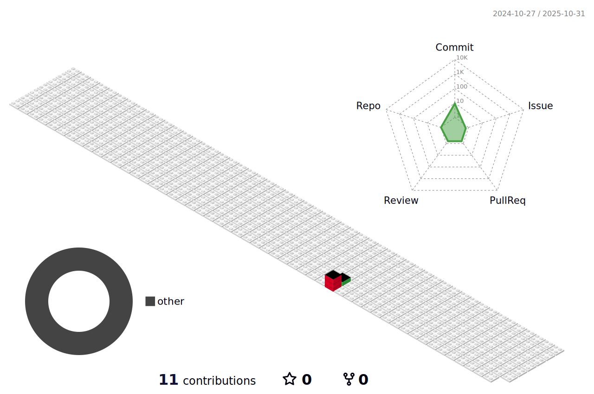

[](https://git.io/typing-svg)


# Hi,there is **Beichuan Tan**👋


- From China.🇨🇳
- Majoring in **Data Science**
- Graduate as **Artificial Intelligence** (*Vocational College*)
- Contact me with [email](FelixFelicisTan@outlook.com)
- A DIVERSE PRODUCERS in Debate | Media Art | etc.


# Recent Contributions



# **Languages and Tools:**  
<code></code>
<code></code>
<code></code>
<code></code>
<code></code>
<code></code>
<code></code>
<code></code>


# **Recent status:**
<!--START_SECTION:waka-->

```txt
Tencent-2025 OpenSourceTalent | 2025腾讯犀牛鸟开源人才培养计划
Tencent-2025 algo | 2025腾讯广告算法大赛
```

<!--END_SECTION:waka-->
